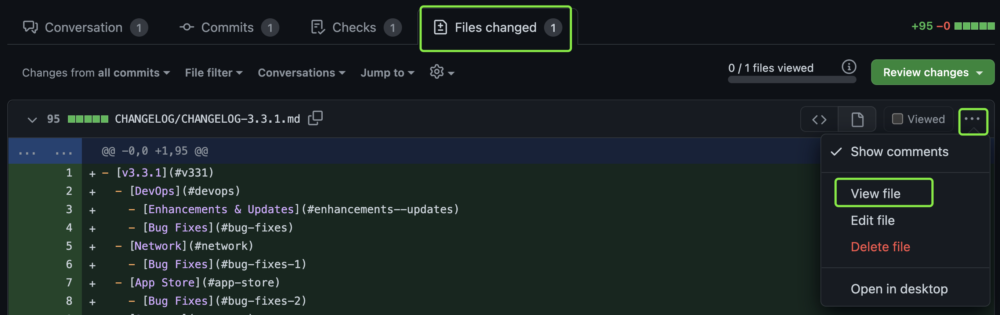

# KubeSphere Website

This repository contains branches that we are working on.

The master branch contains KubeSphere Doc 3.3 which has been released together with KubeSphere 3.3. The frontend website currently displays content based on the master branch. If the pull request you submit applies to both the master branch and other branches, use the command `cherry-pick` to submit the same pull request.

This project uses [Hugo](https://gohugo.io/) to build the KubeSphere website.

## Contribute to the project

Contributions of any kind are welcome! Thanks goes to these wonderful contributors, they made our community and product grow fast.

<a href="https://github.com/kubesphere/website/graphs/contributors">
  
</a>

### Fork and clone the repository

1. Fork the repository.

2. Clone the repository to a local path and access it:

   ```
   git clone https://github.com/<username>/website
   cd website
   ```

### Compile and preview the website

You need to build the website to **publish it as static content.**

#### Install Hugo extended

Go to the [Hugo releases place](https://github.com/gohugoio/hugo/releases) and download the `hugo_extended` version that better suits your OS (version 0.70+).

**EXTENDED version is MANDATORY to properly build the static content!**

Note: If you install Hugo on Windows, you need to add environment variables for the .exe file of Hugo. For example, you place the .exe file in the path `C:\Hugo\bin`. You have to add this path in environment variables. Execute `hugo version` to view if the installation is successful.

### Run the website locally

After you have installed Hugo, run the following command:

```
hugo server -D
```

Now you can preview the website in your browser using `http://localhost:1313/`.

### Open a pull request

Open a [pull request (PR)](https://help.github.com/en/desktop/contributing-to-projects/creating-an-issue-or-pull-request#creating-a-new-pull-request) to make contributions to the repository. Please use DCO sign-off when you submit a pull request. Refer to the command below (add `-s`):

```bash
git commit -s -m "xxx"
```

### Preview a pull request

Go to the **Files changed** tab. Click the three dots of the .md file you want to preview, and then click **View file**. Please note that this method can only give you a preview on the GitHub instead of on the website.



### Cherry pick a commit

The command `cherry-pick` allows you to pick a commit in a branch and integrate it into another branch. For example, we are working on both the master branch and the release-3.2 branch. If the pull request you submit to the master branch applies to the release-3.2 branch as well, perform the following steps:

1. In the master branch, find and copy the commit ID of your pull request.

   ```
   git log
   ```

2. Switch to the release-3.2 branch:

   ```
   git checkout release-3.2
   ```

3. Rebase first:

   ```bash
   git pull --rebase upstream release-3.2
   ```

4. Use the branch release-3.2 to switch to a new branch:

   ```bash
   git checkout -b test
   ```

5. Cherry pick the commit:

   ```bash
   git cherry-pick <CommitID>
   ```

5. Push the commit:

   ```bash
   git push -u origin test
   ```

When you submit the pull request, make sure you submit it to the release-3.2 branch.

## Localization

You are welcome to join the KubeSphere community to contribute to the localization. Please refer to [Localizing the website](localize-website.md) for instructions.

## Build and publish the website (optional)

### Configure your domain

Edit the file `config\_default\config.toml` and modify the var `baseURL` (at the
first line) to set your own domain. It will be hardcoded in the static
files.

```
baseURL = "https://kubesphere.es"
```

#### Build the static content

Just run `hugo` without parameters.

```bash
hugo

                   | EN  | ZH  | TR
-------------------+-----+-----+------
  Pages            |  55 |  65 |  39
  Paginator pages  |   0 |   0 |   0
  Non-page files   |   0 |   0 |   0
  Static files     | 375 | 375 | 375
  Processed images |   0 |   0 |   0
  Aliases          |   1 |   0 |   0
  Sitemaps         |   2 |   1 |   1
  Cleaned          |   0 |   0 |   0

Total in 2396 ms
```

#### Get the generated static content

You will find the previously generated content in the `public` directory.
