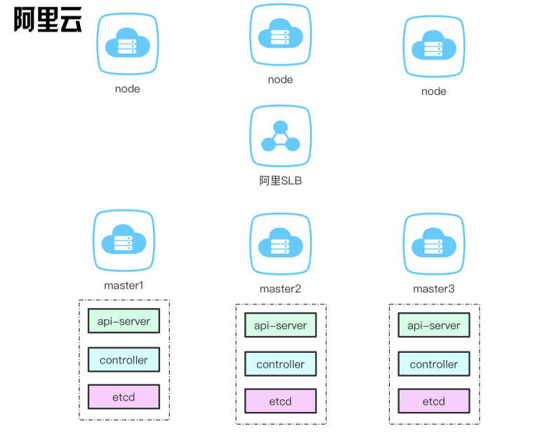
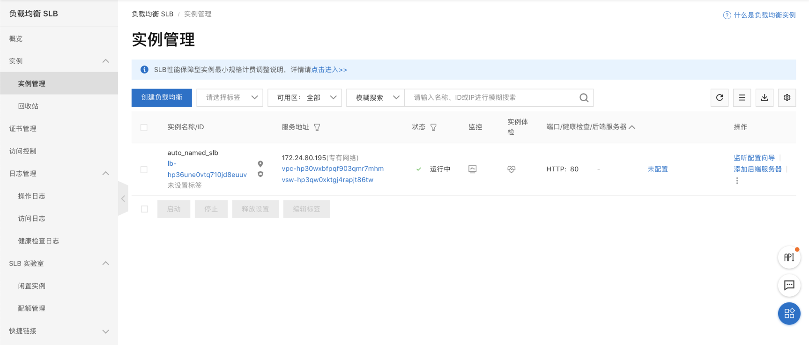
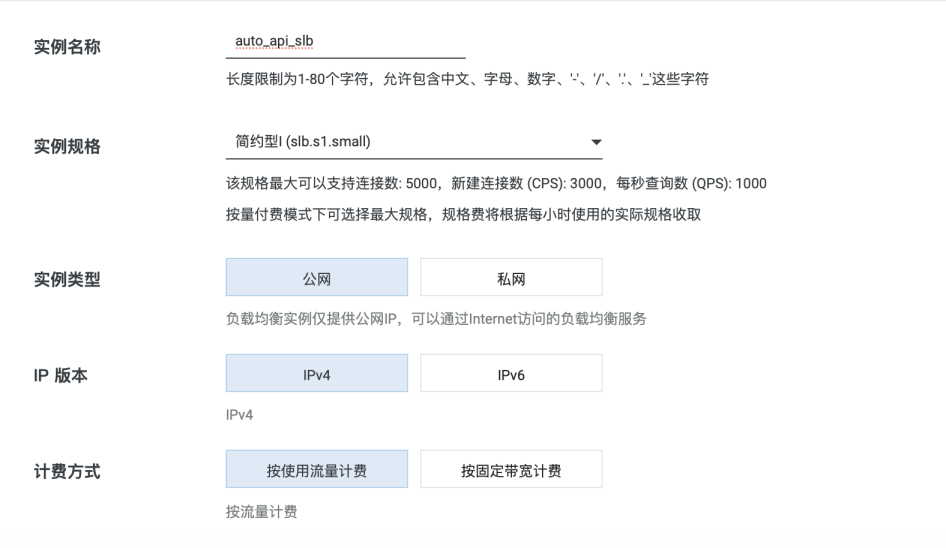
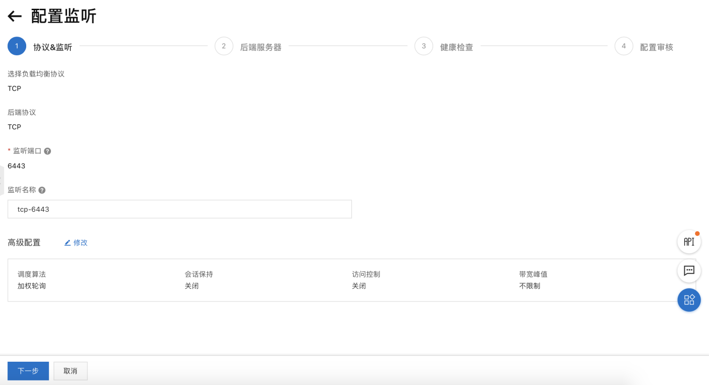
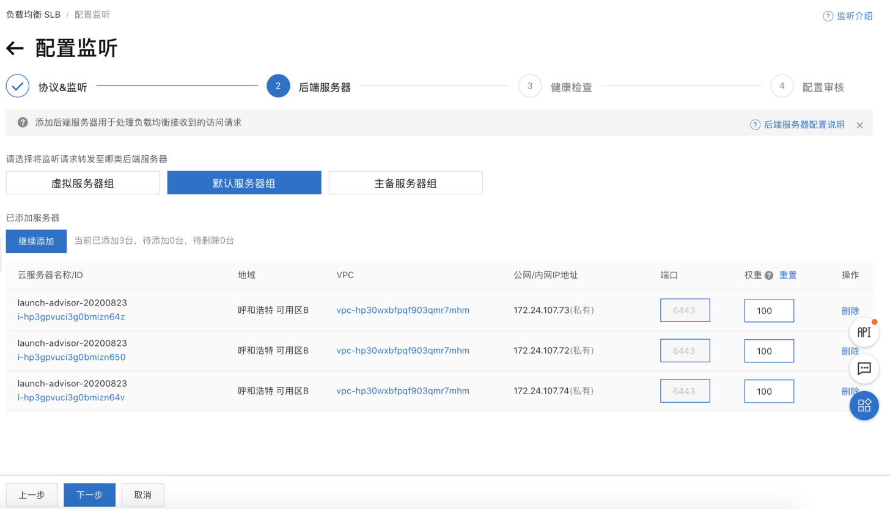
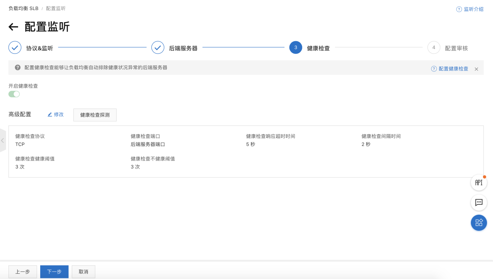
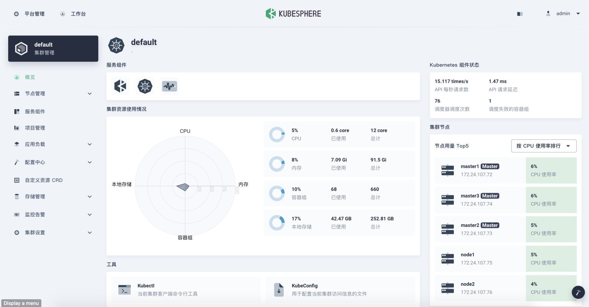

---
 title: "KubeSphere 在 阿里云ECS 高可用实例"
 keywords: "Kubesphere，安装，高可用性，高可用性，负载均衡器"
 description: "本教程用于安装高可用性集群"
 
 Weight: 2229
 ---

 # 在阿里云ECS部署高可用的 KubeSphere

 快速入门 尝试建议All-In-One入手

但对于生产环境，我们需要考虑集群的高可用性。
kubernate服务需要做到高可用,需要保证kube-apiserver的ha,所以推荐下列两种方式
 1. 阿里云SLB
 2. keepalived + haproxy [keepalived + haproxy](https://kubesphere.com.cn/forum/d/1566-kubernetes-keepalived-haproxy)对kube-apiserver进行负载均衡，实现高可用kubernetes集群。

 ## 前提条件

 - 请遵循该[指南](https://github.com/kubesphere/kubekey)，确保您已经知道如何将KubeSphere与多节点集群一起安装。有关用于安装的config yaml文件的详细信息，请参阅多节点安装。本教程重点介绍如何配置负载均衡器。
 - 考虑到数据的持久性，对于生产环境，我们不建议您使用存储OpenEBS,建议nfs,gfs等存储(需要提前安装)。文章为了进行开发和测试，集成的OpenEBS直接将LocalPV设置为存储服务。

 ## 部署架构
 
 ## 创建主机

 本示例创建 SLB + 6 台 **CentOS Linux release 7.6.1810 (Core)** 的虚拟机，每台配置为 2Core16GB50G

 | 主机IP | 主机名称 | 角色 |
 | --- | --- | --- |
 |39.104.82.170|Eip|slb|
 |172.24.107.72|master1|master1, etcd|
 |172.24.107.73|master2|master2, etcd| 
 |172.24.107.74|master3|master3, etcd| 
 |172.24.107.75|node1|node|
 |172.24.107.76|node2|node|
 |172.24.107.77|node3|node|
 机器有限,所以把etcd放入master,在生产环境建议单独部署etcd,提高稳定性

 ## 使用阿里SLB部署
 ###  1. 创建SLB
 
 创建SLB实例
 ### 2. 配置SLB
 

 
 后面的config.yaml 需要配置slb分配的地址
 ```yaml
     controlPlaneEndpoint:
         domain: lb.kubesphere.local
         address: "39.104.82.170"
         port: "6443"
```
 ### 3. 配置SLB 主机实例

添加需要负载的3台master主机 6443端口(api-server)






- <font color=red>现在的健康检查暂时是失败的,因为还没部署master的服务,所以6443端口telnet不通的.
</font>
- 然后提交审核即可

 ### 4. 获取安装程序可执行文件
 ```bash
 #下载installer 至随意一台机器
 curl -O -k https://kubernetes.pek3b.qingstor.com/tools/kubekey/kk
 chmod +x kk
 ```

 ### 创建多节点群集

 您可以使用高级安装来控制自定义参数或创建多节点群集。具体来说，通过指定配置文件来创建集群。

 ### 5. 使用kubekey部署k8s集群 带kubesphere

 ```bash
 # 在当前位置创建配置文件config-sample.yaml|包含kubesphere的配置文件
 ./kk create config --with-kubesphere v3.0.0 -f config-sample.yaml
--- 
# 同时安装存储插件 (支持：localVolume、nfsClient、rbd、glusterfs)。您可以指定多个插件并用逗号分隔。请注意，您添加的第一个将是默认存储类。
./kk create config --with-storage localVolume --with-kubesphere v3.0.0 -f config-sample.yaml
 ```
 ### 6. 多集群配置调整
 ```yaml
 #vi ~/config-sample.yaml
 apiVersion: kubekey.kubesphere.io/v1alpha1
 kind: Cluster
 metadata:
   name: config-sample
 spec:
   hosts:
   - {name: master1, address: 172.24.107.72, internalAddress: 172.24.107.72, user: root, password: QWEqwe123}
   - {name: master2, address: 172.24.107.73, internalAddress: 172.24.107.73, user: root, password: QWEqwe123}
   - {name: master3, address: 172.24.107.74, internalAddress: 172.24.107.74, user: root, password: QWEqwe123}
   - {name: node1, address: 172.24.107.75, internalAddress: 172.24.107.75, user: root, password: QWEqwe123}
   - {name: node2, address: 172.24.107.76, internalAddress: 172.24.107.76, user: root, password: QWEqwe123}
   - {name: node3, address: 172.24.107.77, internalAddress: 172.24.107.77, user: root, password: QWEqwe123}
 
   roleGroups:
     etcd:
     - master1
     - master2
     - master3
     master: 
     - master1
     - master2
     - master3
     worker:
     - node1
     - node2
     - node3
   controlPlaneEndpoint:
     domain: lb.kubesphere.local
     address: "39.104.82.170"
     port: "6443"
   kubernetes:
     version: v1.17.9
     imageRepo: kubesphere
     clusterName: cluster.local
   network:
     plugin: calico
     kubePodsCIDR: 10.233.64.0/18
     kubeServiceCIDR: 10.233.0.0/18
   registry:
     registryMirrors: ["https://*.mirror.aliyuncs.com"] # # input your registryMirrors
     insecureRegistries: []
   storage:
     defaultStorageClass: localVolume
     localVolume:
       storageClassName: local
 
 ---
 apiVersion: installer.kubesphere.io/v1alpha1
 kind: ClusterConfiguration
 metadata:
   name: ks-installer
   namespace: kubesphere-system
   labels:
     version: v3.0.0
 spec:
   local_registry: ""
   persistence:
     storageClass: ""
   authentication:
     jwtSecret: ""
   etcd:
     monitoring: true
     endpointIps: 172.24.107.72,172.24.107.73,172.24.107.74
     port: 2379
     tlsEnable: true
   common:
     es:
       elasticsearchDataVolumeSize: 20Gi
       elasticsearchMasterVolumeSize: 4Gi
       elkPrefix: logstash
       logMaxAge: 7
     mysqlVolumeSize: 20Gi
     minioVolumeSize: 20Gi
     etcdVolumeSize: 20Gi
     openldapVolumeSize: 2Gi
     redisVolumSize: 2Gi
   console:
     enableMultiLogin: false  # enable/disable multi login
     port: 30880
   alerting:
     enabled: false
   auditing:
     enabled: false
   devops:
     enabled: false
     jenkinsMemoryLim: 2Gi
     jenkinsMemoryReq: 1500Mi
     jenkinsVolumeSize: 8Gi
     jenkinsJavaOpts_Xms: 512m
     jenkinsJavaOpts_Xmx: 512m
     jenkinsJavaOpts_MaxRAM: 2g
   events:
     enabled: false
     ruler:
       enabled: true
       replicas: 2
   logging:
     enabled: false
     logsidecarReplicas: 2
   metrics_server:
     enabled: true
   monitoring:
     prometheusMemoryRequest: 400Mi
     prometheusVolumeSize: 20Gi
   multicluster:
     clusterRole: none  # host | member | none
   networkpolicy:
     enabled: false
   notification:
     enabled: false
   openpitrix:
     enabled: false
   servicemesh:
     enabled: false
 ```

 ### 7. 执行命令创建集群
 ```bash
指定配置文件创建集群
./kk create cluster -f config-sample.yaml

查看kubesphere安装日志  -- 直到出现下面的输出结果
kubectl logs -n kubesphere-system $(kubectl get pod -n kubesphere-system -l app=ks-install -o jsonpath='{.items[0].metadata.name}') -f
```
 
 ```
 #### 输出结果
 ```bash
 **************************************************
 task monitoring status is running
 task multicluster status is successful
 total: 2     completed:1
 **************************************************
 task monitoring status is successful
 task multicluster status is successful
 total: 2     completed:2
 **************************************************
 #####################################################
 ###              Welcome to KubeSphere!           ###
 #####################################################
 
 Console: http://172.24.107.72:30880
 Account: admin
 Password: P@88w0rd
 
 NOTES：
   1. After logging into the console, please check the
      monitoring status of service components in
      the "Cluster Management". If any service is not
      ready, please wait patiently until all components 
      are ready.
   2. Please modify the default password after login.
 
 #####################################################
 https://kubesphere.io             2020-08-24 23:30:06
 #####################################################
 ```
### 下图为部署后的使用情况
 


```bash

#删除cluster
 ./kk delete cluster -f config-sample.yaml --debug --skip-pull-images
 #小提示，如果安装过程中碰到`Failed to add worker to cluster: Failed to exec command...`
 kubeadm reset
```
